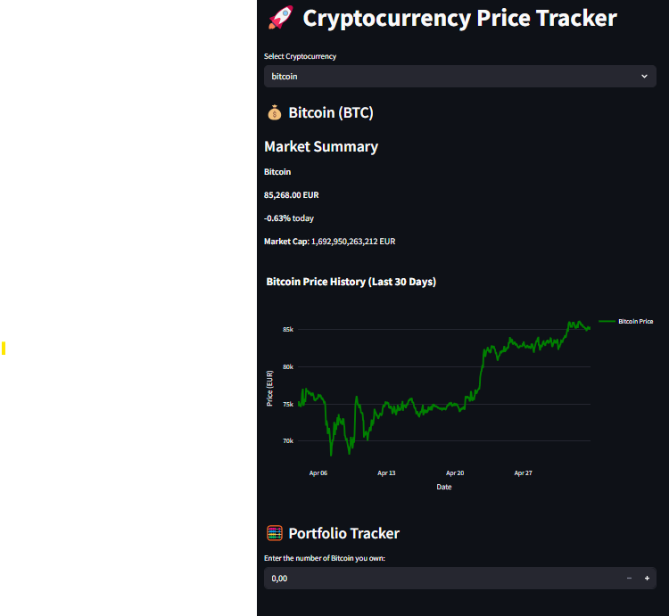

# 🚀 Cryptocurrency Price Tracker (Streamlit App)

This Streamlit app allows you to **track real-time prices**, view **interactive 30-day historical charts**, and calculate your **portfolio value** for popular cryptocurrencies like Bitcoin, Ethereum, Dogecoin, and more — all powered by the CoinGecko API.

🔗 **Live Demo**: [Cryptocurrency Price Tracker](https://cryptotrac.streamlit.app/)  
📁 **Source Code**: This repository  
📸 **Author**: [Sanaullah](https://github.com/Rao-Sanaullah)

---

## 🧩 Features

- ✅ Real-time price tracking via CoinGecko API
- 📉 Interactive 30-day price history charts (with Plotly)
- 💼 Simple portfolio calculator (EUR & USD)
- 🐶 Supports top coins like Bitcoin, Ethereum, Dogecoin, etc.
- 🌓 Dark mode styled layout (Plotly + custom CSS)

---

## 🖼️ Screenshot

  
*(Make sure to upload a screenshot file to your repo)*

---

## 🛠️ How to Run Locally

### ✅ Requirements

Install the required dependencies:

```bash
pip install -r requirements.txt
```

```bash
streamlit run app.py
```

## Contact
For any help, please contact

Sanaullah

